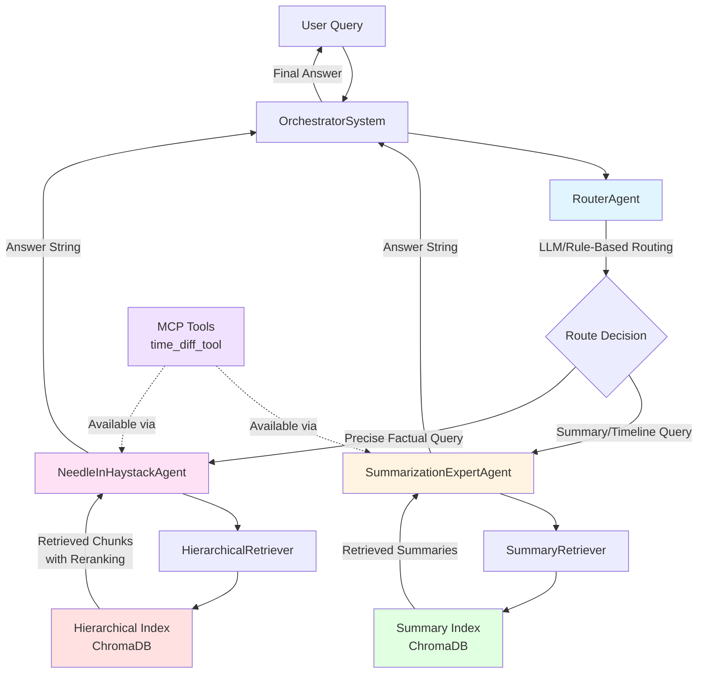

# Agent Architecture Diagram

This file contains the diagram structure that can be imported into draw.io or converted to PNG/JPEG.

## Mermaid Format (for draw.io import or online editors)



## Text-Based Flow Diagram

```
┌─────────────────────────────────────────────────────────────────────┐
│                           USER QUERY                                 │
└─────────────────────────────┬───────────────────────────────────────┘
                              │
                              ▼
                    ┌─────────────────────┐
                    │ OrchestratorSystem  │
                    └──────────┬──────────┘
                               │
                               ▼
                    ┌─────────────────────┐
                    │   RouterAgent       │
                    │  (LLM + Rule-Based) │
                    └──────────┬──────────┘
                               │
                  ┌────────────┴────────────┐
                  │                         │
        ┌─────────▼──────────┐   ┌─────────▼──────────┐
        │Summarization       │   │NeedleInHaystack    │
        │ExpertAgent         │   │Agent               │
        └─────────┬──────────┘   └─────────┬──────────┘
                  │                         │
        ┌─────────▼──────────┐   ┌─────────▼──────────┐
        │SummaryRetriever    │   │HierarchicalRetriever│
        │- Section filtering │   │- Auto-merging       │
        │- Reranking         │   │- Time reranking     │
        │                    │   │- Section reranking  │
        └─────────┬──────────┘   └─────────┬──────────┘
                  │                         │
        ┌─────────▼──────────┐   ┌─────────▼──────────┐
        │Summary Index       │   │Hierarchical Index  │
        │(ChromaDB)          │   │(ChromaDB)          │
        │- Chunk summaries   │   │- Small chunks      │
        │- Section summaries │   │- Medium chunks     │
        │- Document summaries│   │- Large chunks      │
        └────────────────────┘   └────────────────────┘
        
        ┌─────────────────────────────────────────────┐
        │         MCP Tools (Optional)                │
        │  - get_date_diff: Time difference calc      │
        │  (Available to both agents via BaseAgent)   │
        └─────────────────────────────────────────────┘
```

## Component Details for Diagram

### OrchestratorSystem
- Coordinates routing and execution
- Returns final answer string to user

### RouterAgent
- Input: User query
- Process: LLM-based or rule-based classification
- Output: Routing decision (needle/summary)
- Routes to: SummarizationExpertAgent or NeedleInHaystackAgent

### SummarizationExpertAgent
- Purpose: High-level queries, summaries, timelines
- Retriever: SummaryRetriever
- Index: Summary Index
- Features: Section-aware filtering, reranking

### NeedleInHaystackAgent
- Purpose: Precise factual queries
- Retriever: HierarchicalRetriever
- Index: Hierarchical Index
- Features: Auto-merging, time/section reranking, starts at small chunks

### SummaryRetriever
- Retrieval from Summary Index
- Section-aware reranking
- Direct section filtering when single section mentioned

### HierarchicalRetriever
- Retrieval from Hierarchical Index
- Auto-merging of adjacent chunks
- Time-aware reranking (when timestamps in query)
- Section-aware reranking
- Starts at small chunk level for precision

### Indexes (ChromaDB)
- Hierarchical Index: Three granularity levels (small/medium/large)
- Summary Index: Three summary levels (chunk/section/document)
- Both use OpenAI embeddings (text-embedding-3-small)

### MCP Integration
- Tools bound to agents via BaseAgent
- Available to both specialist agents
- Example: time_diff_tool for calculating time differences

## Data Flow

1. **Query Input** → OrchestratorSystem
2. **Routing** → RouterAgent classifies query
3. **Agent Selection** → Routes to appropriate specialist agent
4. **Retrieval** → Agent uses its retriever to get relevant context
5. **Index Query** → Retriever queries ChromaDB index
6. **Context Processing** → Reranking, filtering, auto-merging applied
7. **LLM Generation** → Agent uses retrieved context + LLM to generate answer
8. **Response** → Answer string returned through orchestrator to user

